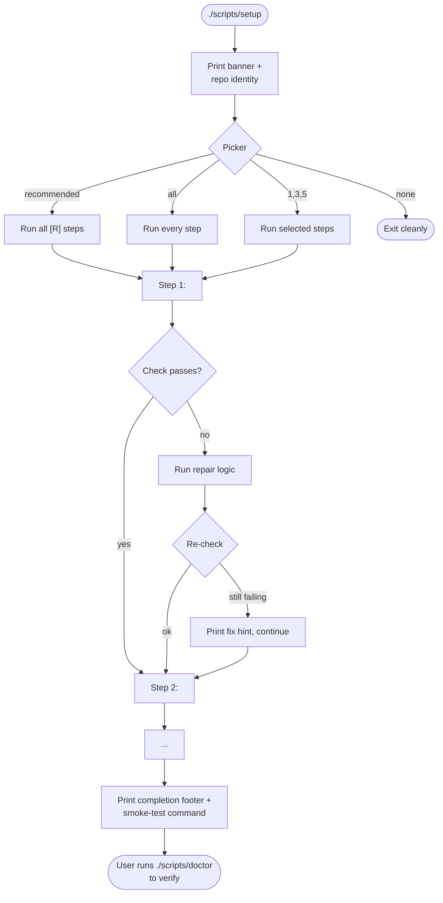

# Wizard Quick Setup — `<REPO NAME>`

> **Template.** Copy this file into the target repo (typically as
> `WIZARD_FLOWS.md` or `docs/SETUP.md`), then fill in the placeholders
> wrapped in `<…>`. Delete this header before committing.

A visual reference for what the setup wizard does, in what order, and
how to recover when a step breaks.

---

## At a glance

| Command                         | What it does                                                              |
| ------------------------------- | ------------------------------------------------------------------------- |
| `./scripts/setup`               | First-run + repair wizard. Picker-driven, idempotent.                     |
| `./scripts/doctor`              | Read-only audit. Re-runs every step's check function and prints results.  |
| `./scripts/setup --pace 0`      | Skip pacing — useful for CI or scripted onboarding.                       |
| `WIZARD_PACE_MS=400 ./scripts/setup` | Slow pacing for first-time users who want extra read time.           |

---

## Decision tree



---

## Steps

| #   | Step                  | Recommended | Check                                           | Repair                                       | Writes                            |
| --- | --------------------- | ----------- | ----------------------------------------------- | -------------------------------------------- | --------------------------------- |
| 1   | `<STEP1 label>`       | `<R/N>`     | `<what the doctor verifies>`                    | `<what the wizard does to fix>`              | `<file paths or "nothing">`       |
| 2   | `<STEP2 label>`       | `<R/N>`     |                                                 |                                              |                                   |
| 3   | `<STEP3 label>`       | `<R/N>`     |                                                 |                                              |                                   |

---

## Picker grammar

| Input         | Means                                            |
| ------------- | ------------------------------------------------ |
| `1,3,5`       | comma-separated indices                          |
| `1-3`         | a range (inclusive on both ends)                 |
| `all`         | every step in the picker                         |
| `recommended` | every `[R]` step (the default if you press Enter) |
| `none`        | exit without running anything                    |

---

## Auth modes (if applicable)

If your repo supports multiple auth flows, document the picker for them
here:

| Mode                | When to pick                                | What the wizard collects                      |
| ------------------- | ------------------------------------------- | --------------------------------------------- |
| Developer Token     | Local dev, testing on your own account      | One token (60-min TTL)                        |
| OAuth 2.0           | Multi-user app, end-user-impersonating      | Client ID, secret, redirect URI               |
| JWT                 | Server-to-server, no user impersonation     | Private key file, passphrase, JWT config JSON |
| Client Credentials  | Server-to-server, modern flow               | Client ID, secret, optional user/enterprise   |

---

## Cross-cutting features

### Pacing
Output is paced so multi-paragraph blocks become readable. Override
with `WIZARD_PACE_MS=<ms>` (`0` disables, `120` is default, `400` is a
slow ramp).

### Progress watchdog
Long-running commands (>5s) print `current action: <description>` so
they don't look hung, and `→ done in 47s` when they finish.

### Self-contained env injection
Steps that need a credential in a subprocess read it from the dotenv
file themselves and inject it into the subprocess env. **You never need
to `source` a file before running the wizard.**

### Auto-repair
For deterministic local fixes (e.g. setting a `git config`, writing a
known-good config file), the wizard applies the repair without
prompting. Network-touching or destructive repairs always confirm.

---

## Common recovery paths

| Symptom                                              | What to try                                                                       |
| ---------------------------------------------------- | --------------------------------------------------------------------------------- |
| `[FAIL] <tool> not on PATH`                          | Follow the install hint, then re-run `./scripts/setup` and pick that step.        |
| `[WARN] <secret> in <file> but not in shell`         | The wizard injects it for the relevant step. For ad-hoc commands, source `<file>`. |
| Step finished but doctor still reports it failing    | `./scripts/setup` and pick that one step — re-runs are safe.                      |
| Picker rejected my input                             | Use commas, ranges, `all`, `recommended`, or `none`. No spaces inside numbers.    |
| Subprocess hangs at a prompt                         | Check the inline cheat sheet the wizard printed before launching it.              |
| Browser-based auth never returns                     | Wizard times out at 2 min and prints a relaunch command.                          |

---

## Verifying success

```bash
./scripts/doctor      # Runs every check function. Should print [OK] for all.
<smoke test command>  # E.g. ./gradlew test --tests SmokeTest, or pytest -k smoke
```

If both pass, you're set up.
